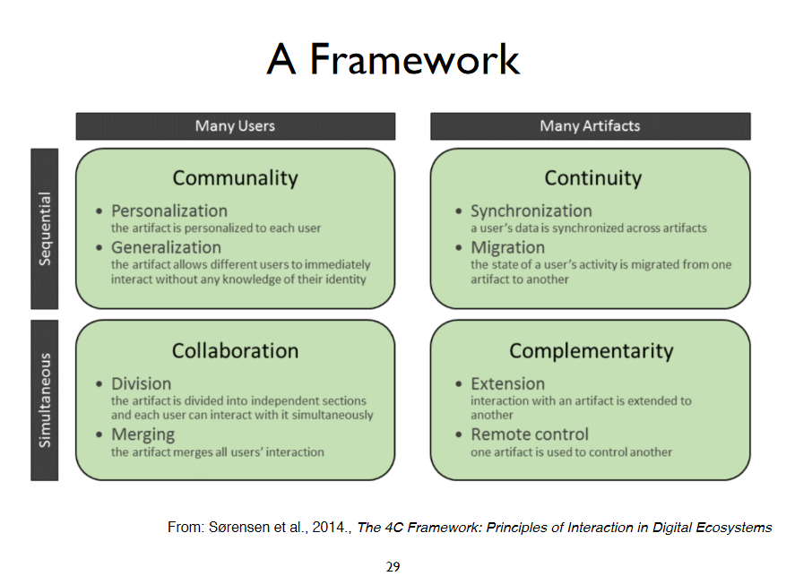

# Question 3

## What is a digital ecosystem? 
A network of nodes that interact with each other through relationships.
This network consists of users and a digital artifacts, dynamically bounded by the users' activities.

## How can we classify interaction with multiple mobile devices in a digital ecosystem? 

## Give short examples of the four categories of interaction (Collaboration, Communality, Complementarity, Continuity)
* **Collaboration**
  * Maps on ones car
* **Communality**
  * A personalized experience in a car
* **Complementarity**
  * An app for your car
* **Continuity**
  * Spotify on in your car

