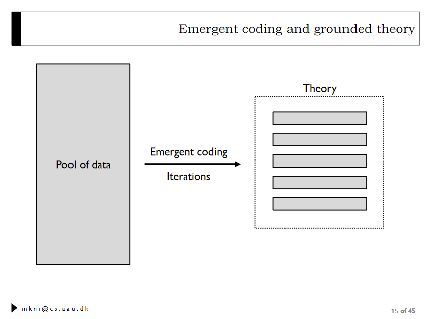
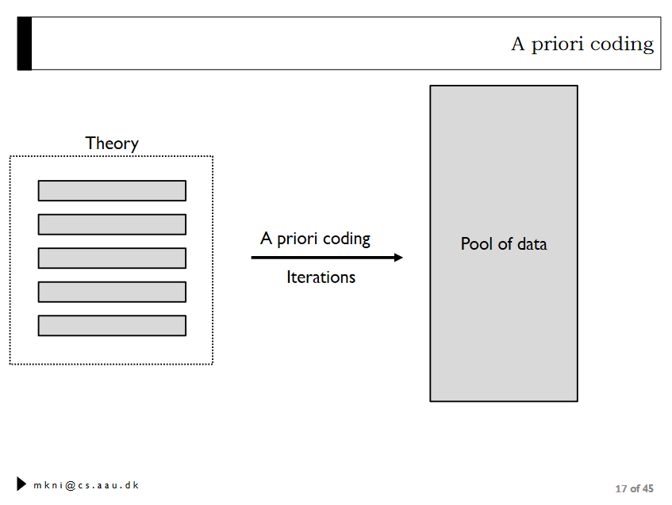

# Question 7

## Assume you have collected qualitative data. What is the process that you need to follow to conduct an analysis of this data? 
Classify unstructured data into categoeries

1. Define the dataset
2. Clean up the dataset
3. Code the dataset
4. Extract findings

## What are the two approaches for coding qualitative data, and what are their differences? 

* Emergent coding
* A priori coding

**Emergent coding**

**A priori coding**
