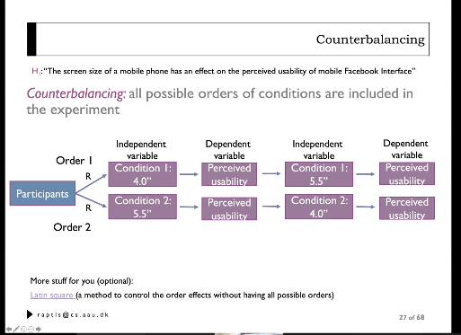
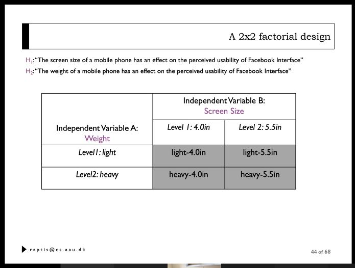

# Question 10

## What is the difference between basic and complex experiments in terms of number of variables and used statistical techniques? 
* Basic: One independent variable, minimum 2 levels
* Complex: More than two independent variables. minimum 2 levels.

## What are the differences between between-subjects and within-subjects designs? 
* Between subjects design: One participants experiences one of the conditions of our design.
* Within subjects designs: One participant experiences all of the conditions of our designs.

## What are their advantages and disadvantages? 
* Within-subject design
  * *advantages*
  * fewer participants
  * systematic error will be the same in both conditions. 
  * *disadvantages*
  * har to control practice, order and fatigue effects.

* Between-subject design
  * *advantages*
  * Easier to control practice, order and fatigue effects
  * *disadvantages*
  * Many participants
  * systematic error is more difficult to control.

Same technique, but different statistical technique.
3 T-tests performed at the same time.
