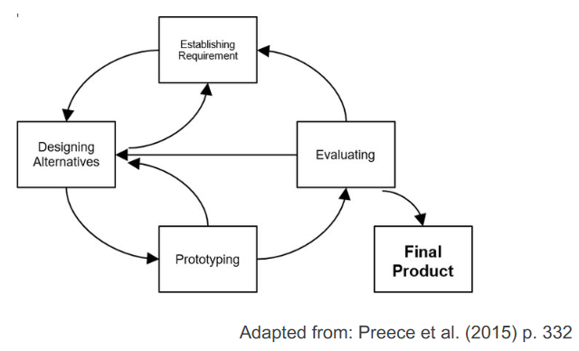
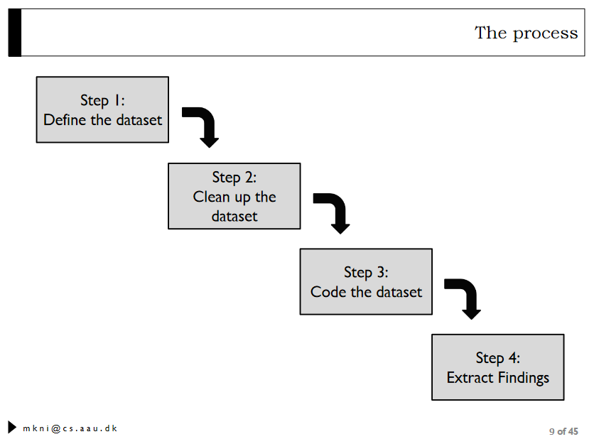
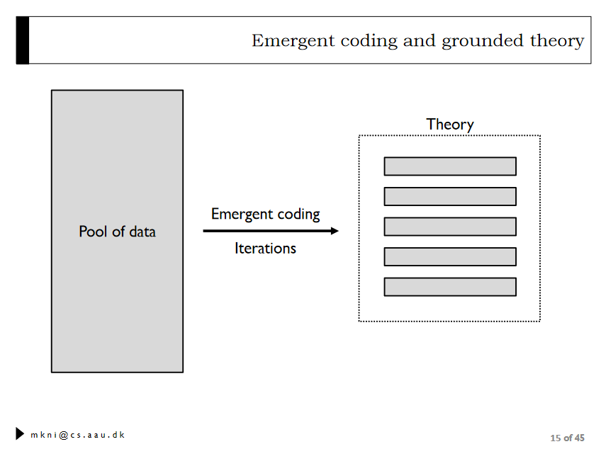
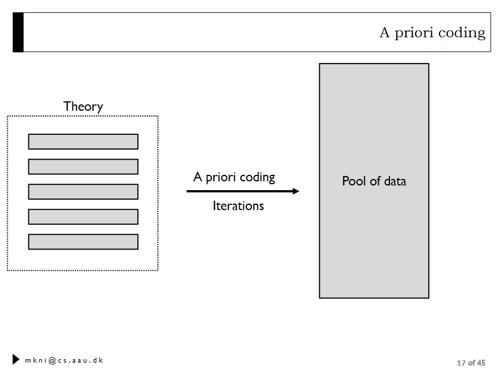

# Question 1

## How can we define and characterize mobile computing? Give examples of the different eras.

## What is context and why is important for mobile computing?

## What is Big C and Small C?

-   **Big C**: Context, what do users need
-   **small c**: What is required to fulfil that

## How can we communicate context to others?

# Question 2

## How can we collect data about the context of our idea?

-   Interviews: We ask deep
-   Questionnaires: We ask in general
-   Observation:

## Give examples of the different ways of communicating your idea to other team members/costumers/users?

Personas

# Question 3

## What is a digital ecosystem?

## How can we classify interaction with multiple mobile devices in a digital ecosystem?

## Give short examples of the four categories of interaction (Collaboration, Communality, Complementarity, Continuity)

# Question 4

## Why is it important for designers know the difference between devices and platforms when we design for them?

## What is skeuomorphism?

### Skeuomorphic Design

Term used for graphical user interface design to describe interface
objects that mimic their real-world counterparts in how they appear
and/or how the user can interact with them.

## How do we ensure that our design will fit into the mobile platform that we design for (e.g., Android, iOS)?

We uphold the guidelines set by the platform to ensure consistency.

# Question 5

## What is a prototype?

A prototype is a simple experimental model of a proposed solution used
to test or validate ideas, design assumptions and conceptualisation
quickly and cheaply.

## When in the design process do, we introduce prototypes?

In the prototyping phase - 3rd phase.

1.  Establishing Requirements
2.  Designing alternatives
3.  Prototyping
4.  Evaluating

 ## Give examples of the different prototypes
and their strengths and weaknesses. ##\# Sketches - **Strengths**: -
**Weaknesses**:

### Software (e.g wireframe - Figma)

-   **Strengths**:
-   **Weaknesses**:

# Question 6

## What kind of data can we collect in mHCI evaluations and how?

-   People's attitudes, beliefs and perceptions
-   People's behaviors. We focus on past or future behavior
-   People's facts and demographics
-   People's performance

## Why do we collect such data, what is our purpose?

To gather information about the user's perception of the solution. We as
designers and programmers may have an one understanding of the user, but
if the user has another perception, we may have to change our view of
the user. To provide another aspect: re-evaluate our alignment with the
user.

## Are there any differences between conducting evaluations in a lab and the field?

Yes?

# Question 7

## Assume you have collected qualitative data. What is the process that you need to follow to conduct an analysis of this data?

Classify unstructured data into categoeries

1.  Define the dataset
2.  Clean up the dataset
3.  Code the dataset
4.  Extract findings

## What are the two approaches for coding qualitative data, and what are their differences?

-   Emergent coding
-   A priori coding

**Emergent coding**  **A priori
coding** 

# Question 8

## What is a research hypothesis, and are there different types?

## What is the difference between independent and dependent variables?

## What is the operational definition of a variable?

## How can we assess the quality of operational definitions?

# Question 9

## What can be the sources of systematic errors in an experiment?

-   Participants
-   Researchers
-   Digital artifacts
-   Environment
-   Procedure
-   Measurement tools

## What can we do in order to minimize/eliminate them?

??

## Why is it important to pilot test?

-   Make sure that everything is working as expected
-   Make sure that the participants are influenced only by the
    independent variable among the conditions
-   Have preliminary findings that will tell us if we need more
    conditions, or a different setup.
-   Check the tasks we have designed for:
    -   Ceiling effect: Too easy task. All participants reach max
        performance
    -   Floor effect: Too difficult tasks. Noone performs well.

# Question 10

## What is the difference between basic and complex experiments in terms of number of variables and used statistical techniques?

-   Basic: One independent variable, minimum 2 levels
-   Complex: More than two independent variables. minimum 2 levels.

## What are the differences between between-subjects and within-subjects designs?

-   Between-
-   Between-group designs: Different participants experience the
    conditions ## What are their advantages and disadvantages?
